# User Manual

### Should you want to directly run the Swift compiler, and choose not to view the error messages and changes I've made for the project as a fix-it from within Xcode, you must do the following: 

1. Fork the [Swift repository](https://github.com/apple/swift). 

2. Follow [Swift's getting started guide](https://github.com/apple/swift/blob/main/docs/HowToGuides/GettingStarted.md) to know how to accurately clone your fork, install the proper dependencies, and learn how to build and test the project. Note that takes 3.5 GB to clone the repository, as well as additional storage to store any build artifacts when you are building the project. Build artifacts take anywhere between 5 to 70 GB of storage, depending on your build settings, which you can modify in Xcode. For more information on build settings, look at [this source](https://xcodebuildsettings.com/).

3. After going through the steps provided by the getting started guide, open the `Swift.xcodeproject` file from within your build folder, which can be found in your cloned swift project.

4. From there, once Xcode opens, you will be asked if you want to autogenerate schemes. Say `Manually Manage Schemes`. From there, navigate to `Manage Schemes` from the `Product` menu

    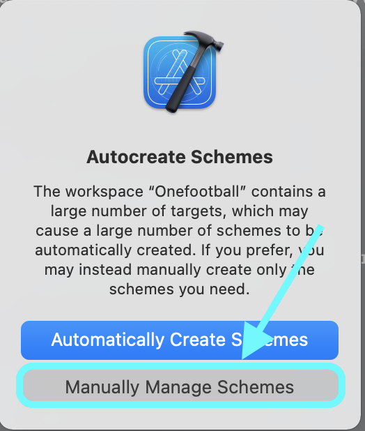
    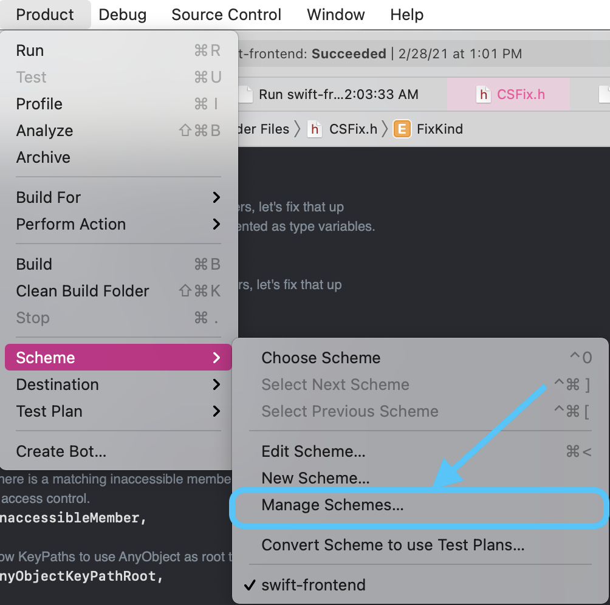

5. From there, click the plus button on the bottom left of the popup
    
    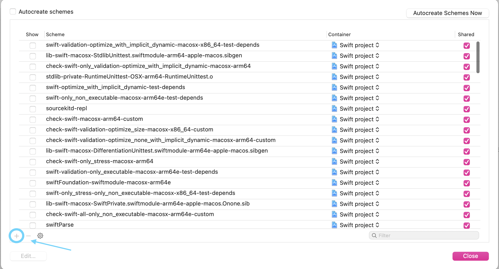

6. Next, click the target menu, type `swift-frontend`, and select it 

    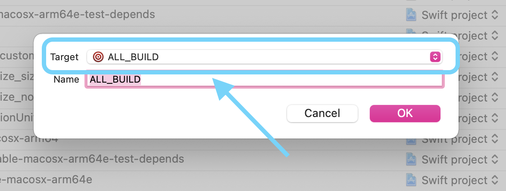
    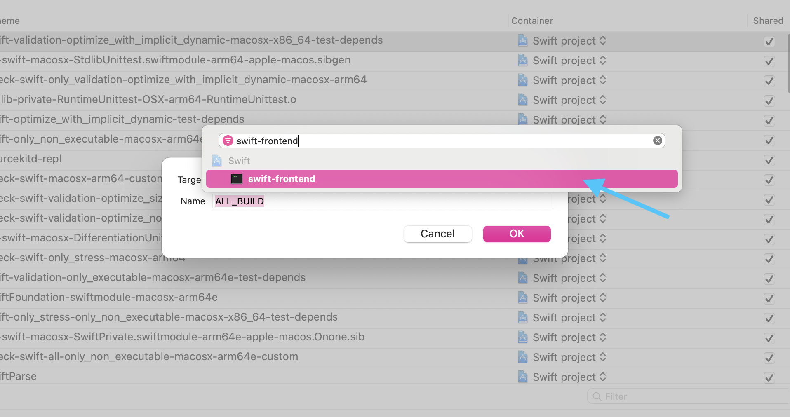

    Note that after doing this, once you return back to the manage schemes editor, the only scheme that should be selected is `swift-frontend`
    
    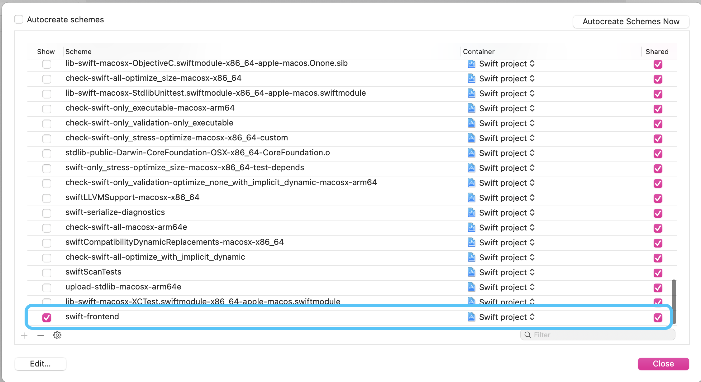
    
    Also note that once you get back to Xcode's main editor, your scheme name should show up as `swift-frontend`
    
    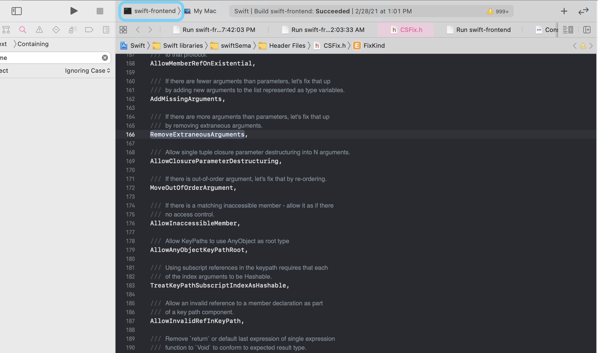

7. Now, click your scheme, and click `Edit Scheme`

    
    
8. From here, begin to add the following arguments (highlighted in blue) to set up your scheme under the `Run` tab in the scheme editor. Note that the last target should include a path to a test program written in Swift that you would like to pass to the compiler. That way, when you click the run button, your compiler will process the file you pass it, and write any output to the command line that is embedded in Xcode. 

    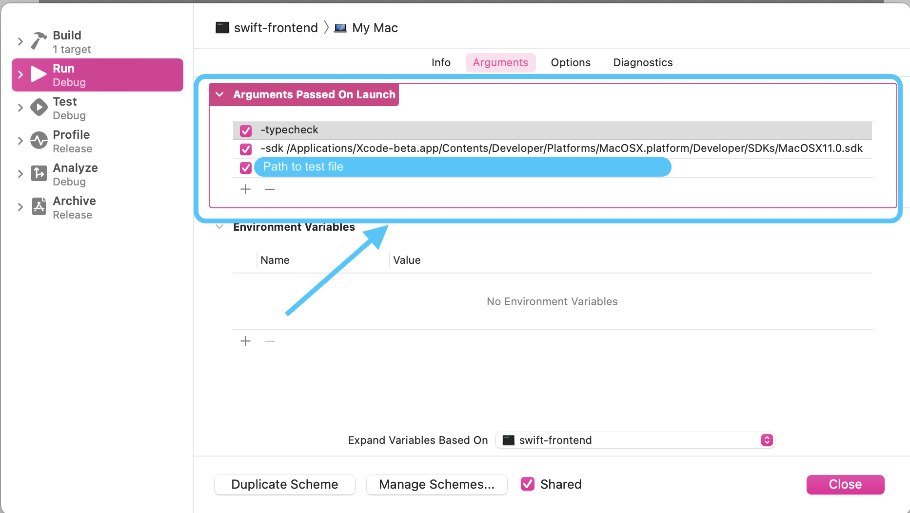

9. Now, you can run the compiler by clicking the `Run` button from within Xcode's main editor to build and run the compiler
    
    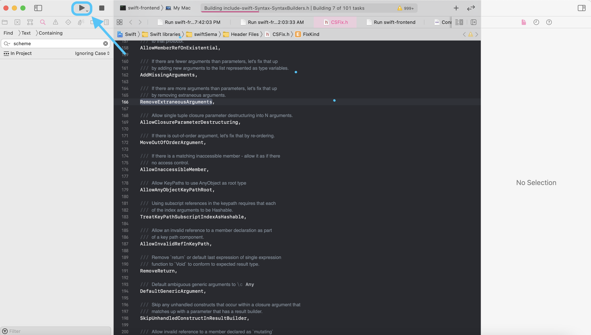
    
    Note that you can see the output of the compiler by navigating to the following sidebar (which lists the different logs for Xcode) and clicking the heading that says `Run swift-frontend` followed by the time you ran it. You have to wait for the compiler to finish building before this heading will show up 
    
    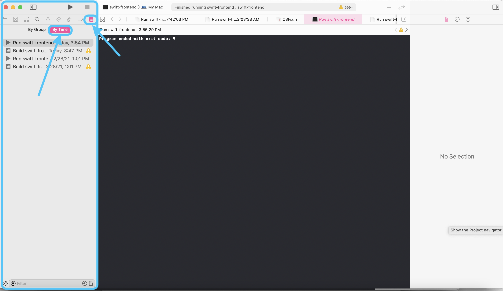
    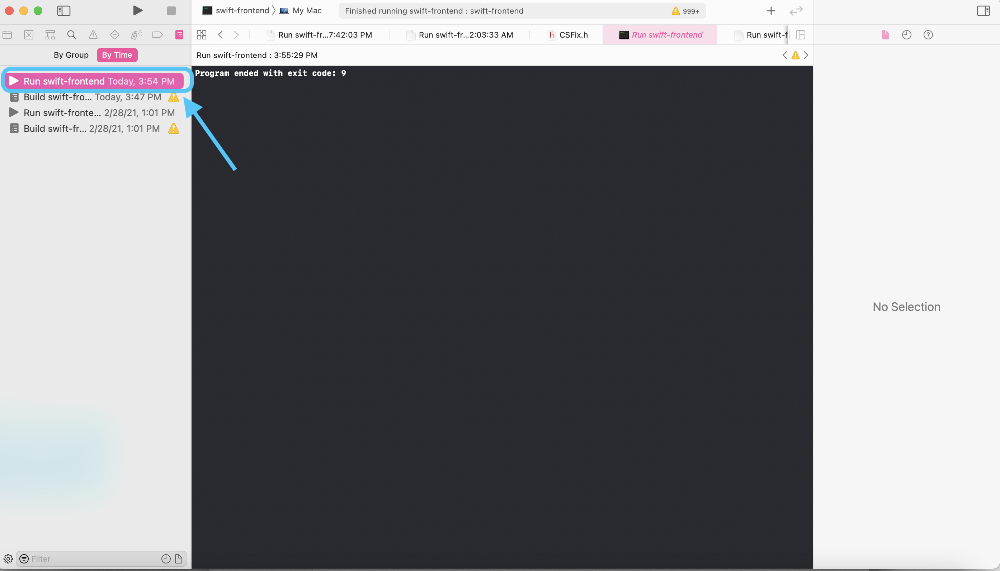

    
    ### If you want to just see the fix-it, simply write your program in Swift from within Xcode and build and run your program. The fix-it should reflect any errors that I wrote, should they apply to your program. They will look something like this (fixit is highlighted in blue)
    
    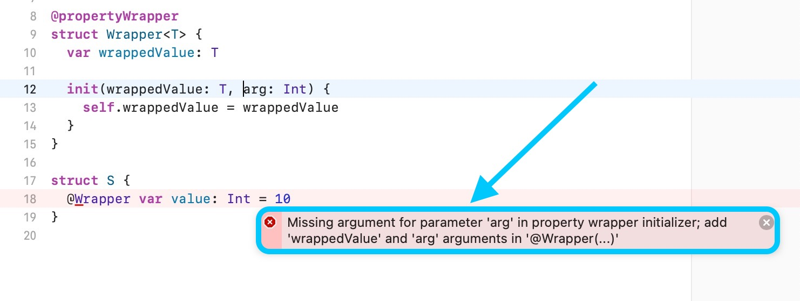
    

    
    
    

